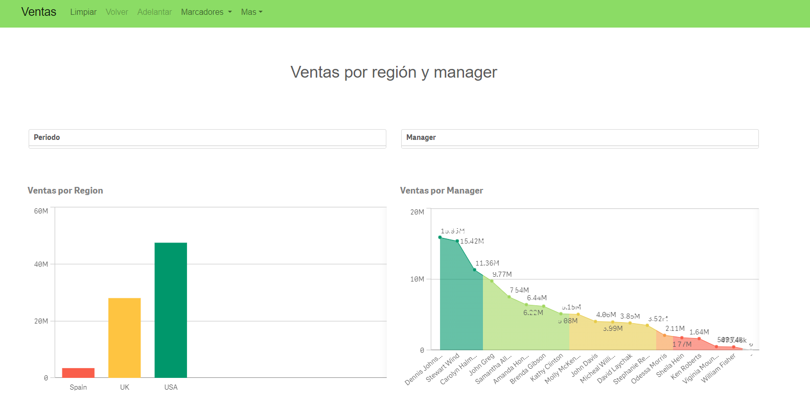

# Qlik Mashup

Developed a Qlik mashup using Qlik Sense Desktop and the Dev Hub.
My HTML, CSS and JS knowledge was applied along with the use of objects developed in a Qlik dashboad.
The final result is a webpage that consumes Qlik objects and workds dinamically.

  

I analyzed a dataset of sales per region and manager. I developed Qlik barplots and area plots. I also introduced filter panels to let the user select the information to analyze. I also showed the best sellers by region and city along with their total sales using KPI.

https://github.com/melisadigiacomo/Qlik_mashup/assets/87764919/b10b979c-44be-4014-b968-c832a9f2cc5e
